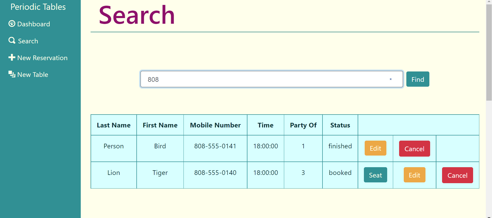

# Periodic Tables

[Test Out the App](https://www.markdownguide.org)

---
**Technologies used:** *PostgreSQL, Express, Knex, React, Bootstrap, CSS*

---

This application exists for the restaurant industry. The typical user would be the employee(s) in charge of managing reservations and tabling at a restaurant. With Periodic tables, the user can easily: 

- See existing reservations
- Record a new reservation
- Update an old reservation with new information
- Enter a new table
- "Seat" a reservation at a free table, thus making that table "occupied"
- "Finish" a reservation's tabling when they have completed their meal. This moves the table back from "occupied" to "free" and removes the reservation from the database.

## Dashboard 

**The data that populates both tables is retreived from a PostgreSQL database using an Express and Knex-based API.**

Upon startup, the application loads the Dashboard page, which is set to display both the "reservations" table and "tables" table. The Dashboard defaults to today's date, so it will only load reservations that are set for today. 

## Create/Update Forms

**New reservations and tables are created using a fetch that sends a post request with the form input data to the API. Reservations are updated similarly, except a put request is used instead of a post request. The API takes each form submission through a validation process that checks for certain constraints, such as valid form inputs and reservations being made at a future date and time.**

In the case of a reservation update, the form will be pre-populated with the reservation data. 

## Search

**The API retrieves all reservations by phone number using the same get functionality as the Dashboard page.**

The application will retreive all reservations that include the inputed string of numbers in their "mobile number." For example, a reservation with the phone number "555-666-7777" would come up for a search of "77."

When the search does not match any reservation's mobile number, a message will display the words "no reservation found."

## Seating Reservations and "Finishing" Tables

Clicking the Seat button will bring the user to the "Seat Reservation" page. 

**The API contains validation for seating reservations at tables. For example, the user can not seat a reservation at a table whose capacity is less than the reservation's number of people.**

When a reservation is seated, a "Finish" button appears next to its table. Clicking it will remove the "Finish" button, re-activate the table's availability, and "close" the reservation. 

**When the user clicks "Finish", the API changes the table's status from "occupied" back to "free," and removes the reservation from the database.**
